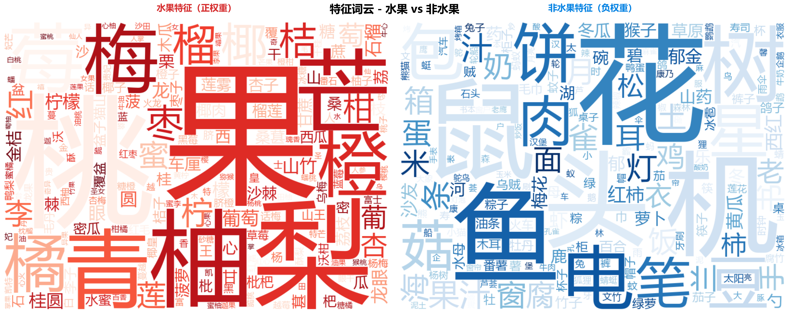

# 水果分类器学习笔记

## 写这个项目的初衷

我想学 AI，但不知道从哪开始。看了一圈教程，发现光看理论根本记不住，得动手做点东西。

我选了个最简单的任务：判断一个词是不是水果。这任务简单到有点傻，但正好适合入门——能快速看到效果，不会因为太难而放弃。

整个项目都是在 Claude Code 里完成的，包括写代码、准备数据、调试优化。边做边学，比看书效率高多了。

## 做了什么

### 准备数据

刚开始我让 Claude Code 帮我生成了一百多条数据：水果类的有苹果、香蕉、西瓜这些，非水果类的有桌子、椅子、手机这些。

训练完发现效果不好，准确率只有 76%。问了下才知道数据太少了，于是又扩充到 300 多条。这次我加了很多之前没想到的：

- 同一个水果的不同叫法（猕猴桃/奇异果、樱桃/车厘子）
- 具体品种（砂糖橘、金枕榴莲、红心火龙果）
- 各种非水果（动物、植物、食物、日用品都加了点）

最后凑了 323 条，水果 129 个，非水果 194 个。

### 特征提取这块

机器看不懂"苹果"这两个字，得把它变成数字。我用的办法是把词拆开，拆成单个字和两个字的组合：

- "苹果" 会被拆成："苹"、"果"、"苹果"
- 然后统计这些字符的出现情况
- 最后变成一串数字给模型

这个过程用了 sklearn 里的 CountVectorizer，设置了几个参数：

- 按字符拆（analyzer="char"）
- 用 1-2 个字符的组合（ngram_range=(1,2)）
- 只保留最重要的 500 个特征（max_features=500）

### 训练模型

用的是逻辑回归，最简单的分类算法。它会根据训练数据学习"什么样的字符组合更可能是水果"，然后给新词打分。

## 踩过的坑

### 第一个坑：过拟合

第一次训练完，训练数据准确率 100%，看起来很完美。但测试数据只有 76%，差距太大了。

Claude Code 告诉我这是"过拟合"——模型把训练数据背下来了，但没学会真正的规律。

解决办法：

- 数据从 104 条扩充到 323 条
- 调整了正则化参数（C 从 1.0 改成 0.5）
- 限制特征数量（只用 500 个最重要的）

改完之后训练准确率降到 98.8%，测试准确率升到 80%。虽然训练准确率下降了，但这反而是好事。

### 第二个坑：模型偏心

因为非水果样本比水果多，模型学会了"不确定的时候就猜非水果"。结果就是水果识别率特别低，10 个水果只能认出 5 个。

加了一个参数 class_weight='balanced' 就好了。这个参数让模型更重视少数类别，不会一味偏向多数。

### 第三个坑：差点犯的错

我本来想先把所有数据处理成特征，再分训练集和测试集。Claude Code 提醒我这样会"数据泄露"——测试集的信息会影响特征提取过程，导致测试结果不可信。

正确做法是：

1. 先分训练集和测试集
2. 只在训练集上学习怎么提取特征
3. 测试集用训练集学到的方法转换

这个细节很容易忽略，但很重要。

## 最后的效果

```
总数据：323 条
训练集：258 条
测试集：65 条

训练准确率：98.84%
测试准确率：80.00%
```

混淆矩阵：

```
┌──────────────────────────────────────────────────┐
│                  预测结果                  │
├───────────────┬────────────────┬────────────────┤
│    实际类别     │     非水果      │      水果      │
├───────────────┼────────────────┼────────────────┤
│ 非水果        │       36       │       3        │
│ 水果          │       10       │       16       │
└───────────────┴────────────────┴────────────────┘

📌 说明:
   ✅ 预测正确: 52 个 (80.0%)
   ❌ 预测错误: 13 个 (20.0%)
      - 把水果误判为非水果: 10 个 (漏判)
      - 把非水果误判为水果: 3 个 (误判)
```

可以看出：

- 非水果识别得挺好（36/39，92%）
- 水果识别稍微差点（16/26，62%）
- 主要问题是会漏判水果，可能因为水果名字变化更多

### 关于混淆矩阵

刚开始我只看准确率 80%，觉得还不错。后来看了混淆矩阵才发现还有很多细节：

```
┌──────────────────────────────────────────────────┐
│                  预测结果                  │
├───────────────┬────────────────┬────────────────┤
│    实际类别     │     非水果      │      水果      │
├───────────────┼────────────────┼────────────────┤
│ 非水果        │       36       │       3        │
│ 水果          │       10       │       16       │
└───────────────┴────────────────┴────────────────┘

📌 说明:
   ✅ 预测正确: 52 个 (80.0%)
   ❌ 预测错误: 13 个 (20.0%)
      - 把水果误判为非水果: 10 个 (漏判)
      - 把非水果误判为水果: 3 个 (误判)
```

**这个表怎么看？**

四个格子代表四种情况：

- 左上（36）：非水果 → 预测非水果 ✅
- 右上（3）：非水果 → 预测水果 ❌ （把键盘当成水果）
- 左下（10）：水果 → 预测非水果 ❌ （把榴莲当成非水果）
- 右下（16）：水果 → 预测水果 ✅

**能看出什么问题？**

虽然总准确率 80%，但两类样本的表现差很多：

- 非水果识别率：36/39 = 92%
- 水果识别率：16/26 = 62%

而且错误主要集中在"漏判水果"（10 个），"误判非水果"只有 3 个。

如果做成 APP，用户输入"榴莲"结果告诉他不是水果，体验会很差。所以下一步优化应该重点提高水果的识别率。

**训练时看到的几个指标**

- **Precision（精确率）**：16 / (16+3) = 84%
  → 我说是水果的，84% 真是水果

- **Recall（召回率）**：16 / (16+10) = 62%
  → 100 个水果，我只认出 62 个

- **F1 分数**：2 × (0.84 × 0.62) / (0.84 + 0.62) = 71%
  → 精确率和召回率的综合评分

我的模型特点是"精确率高，召回率低"——说是水果的时候比较准，但会漏掉不少水果。

## 特征可视化

运行 `python visualize.py` 后，可以看到模型学到了哪些特征来区分水果：

### 特征权重分析


从图表可以看出：
- **左上角**：最重要的 15 个特征，红色是水果特征，蓝色是非水果特征
- **右上角**：最强的水果特征（如"果"、"莓"、"子"等字符）
- **左下角**：最强的非水果特征（如"机"、"器"、"椅"等字符）
- **右下角**：所有特征权重的分布情况

### 特征词云



词云直观展示：
- **左侧（红色）**：水果相关的字符越大，说明该字符在判断水果时权重越高
- **右侧（蓝色）**：非水果相关的字符越大，说明该字符在排除水果时权重越高

可以看到，模型学到了很符合直觉的规律：
- 水果特征："果"、"莓"、"瓜"、"桃"、"橘"、"柿"等
- 非水果特征："机"、"器"、"椅"、"桌"、"电"等

## 代码说明

### 数据划分和特征提取

```python
# 先分训练测试集
X_train_text, X_val_text, y_train, y_val = train_test_split(
    data["word"],
    data["label"],
    test_size=0.2,
    random_state=42,
    stratify=data["label"]  # 保持类别比例
)

# 特征提取器
vectorizer = CountVectorizer(
    analyzer="char",        # 按字符拆
    ngram_range=(1, 2),     # 1 个字符 + 2 个字符的组合
    max_features=500        # 最多 500 个特征
)

# 只在训练集上学习特征
X_train = vectorizer.fit_transform(X_train_text)
# 测试集用学到的方法转换
X_val = vectorizer.transform(X_val_text)
```

### 模型训练

```python
model = LogisticRegression(
    max_iter=1000,
    class_weight='balanced',  # 平衡类别
    C=0.5,                    # 正则化强度
    random_state=42,          # 固定随机种子
    solver='liblinear'        # 适合小数据集
)

model.fit(X_train, y_train)
```

## 怎么用

### 1. 训练模型

```bash
python train.py
```

会显示数据统计、训练过程、评估结果。

### 2. 可视化特征

```bash
python visualize.py
```

生成模型学到的特征可视化：

- **feature_visualization.png**：4 张图表展示特征权重
- **wordcloud.png**：词云对比图，直观展示水果 vs 非水果特征

**能看出什么？**
- 哪些字符/字符组合最能区分水果（比如"果"、"莓"、"瓜"）
- 哪些字符组合强烈暗示非水果（比如"机"、"器"、"子"）
- 模型的决策依据是否符合直觉

> 💡 详细的可视化结果见下方「特征可视化」章节

### 3. 预测新词

```bash
python predict.py
```

然后输入词语就能看到结果：

```
请输入一个词：榴莲
榴莲 -> 水果

请输入一个词：键盘
键盘 -> 非水果
```

## 文件结构

```
.
├── data.csv                     # 训练数据（323 条）
├── train.py                     # 训练脚本
├── predict.py                   # 预测脚本
├── visualize.py                 # 特征可视化脚本
├── requirements.txt             # 依赖包
├── model.joblib                 # 训练好的模型
├── vectorizer.joblib            # 特征提取器
├── feature_visualization.png    # 特征可视化图表（运行 visualize.py 后生成）
└── wordcloud.png                # 特征词云图（运行 visualize.py 后生成）
```

## 下一步想做的

- 加一些边界案例进去，比如番茄（到底算不算水果？）
- 试试其他算法，看看能不能提高准确率
- 做个网页版，输入框更友好

## 总结

这个项目很简单，但让我对机器学习有了具体的认识。从完全不懂，到能自己调数据、改参数、看指标，感觉学到了不少东西。

最关键的是，在 Claude Code 里边做边学，有问题马上问，比自己看教程效率高太多。

如果你也想学 AI，建议从这种简单任务开始。别想着一步登天，先把流程跑通，建立信心，后面自然就能做更复杂的。
