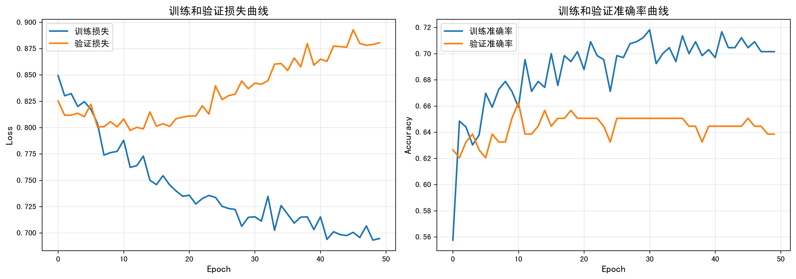
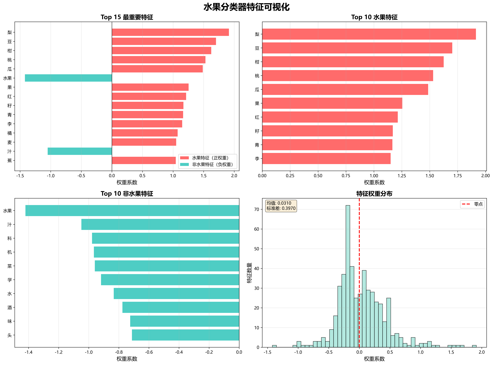
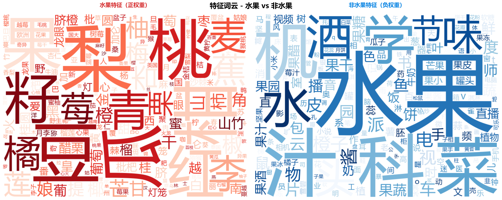

# 水果分类器学习笔记（CNN 版）

## 为什么做这个项目

做完第一个水果分类器，我觉得还挺有意思的，就想着能不能用深度学习试试。毕竟现在都说深度学习厉害，我也想学学。

这次试试字符级 CNN（深度学习），看看能不能提升效果。

结果没想到，这个项目给了我一个意外的"教训"。

## 项目经历

### 迭代 1：首次尝试 CNN（323 条数据）

用第一个项目的 323 条数据训练了一个字符级 CNN。模型不复杂：

- 把每个字符转成向量（字符嵌入）
- 用不同大小的卷积核提取特征（2-gram、3-gram、4-gram）
- 池化、dropout、全连接层
- 最后输出是不是水果

结果出来：验证准确率 **69.23%**

懵了，逻辑回归是 80%，深度学习反而更差？

问了下 Claude Code，它说可能是：

- 数据太少（323 条对深度学习确实少）
- 任务太简单（水果名就 2-4 个字）
- 逻辑回归的 n-gram 特征已经够用了

但我还是想试试，毕竟才 300 多条数据。

### 迭代 2：扩充数据（826 条）

这次我认真扩充了数据：

- 加了很多学术名称（红富士、阿克苏苹果）
- 加了水果加工品（苹果汁、草莓酱）
- 加了各种品牌（苹果手机、番茄小说）
- 还有很多日常词汇

但有个问题困扰我：番茄到底算不算水果？核桃算不算？

后来我选择了**植物学标准**：果实 = 由子房发育的器官。这样虽然和日常理解不同，但标准统一，不会有歧义。

根据这个标准：

- 番茄、黄瓜、辣椒 → 水果（是果实）
- 核桃、板栗、花生 → 水果（是坚果类果实）
- 生姜、芹菜、白菜 → 非水果（是茎或叶）

重新标注后，数据从 323 条扩到 826 条。

**训练结果**：

- CNN：66.27%（反而下降了）
- 逻辑回归：81.33%（稳步提升）

差距拉大了。

### 迭代 3：疯狂调参（826 条）

我想，会不会是参数不对？于是写了个超参数搜索脚本：

- embedding 维度：16/32/64
- 卷积核数量：32/64/128
- dropout：0.3/0.5/0.7
- 学习率、batch size 也都试了

随机试了 20 组参数...

**最好结果**：66.87%

只比原来提升了 0.6%。20 组参数几乎都在 64.5%-66.9% 之间，怎么调都突破不了。

这时候我意识到：可能不是参数的问题，而是模型就不适合这个任务。

### 迭代 4：继续扩充数据（1051 条）

我还是不死心，想着再加点数据试试。这次加了：

- 植物学术语（子房、胚珠、花被、果皮）
- 植物分类（被子植物、裸子植物）
- 果实类型（浆果、核果、坚果、蒴果）
- 谷物豆类（小麦、大豆、红豆）
- 更多蔬菜（生姜、大蒜、芹菜）

数据扩到 1051 条。

**结果让我大跌眼镜**：

- CNN：59.24%（暴跌 7 个百分点！）
- 逻辑回归：86.26%（继续提升）

CNN 彻底崩了。

## 为什么会这样？

反思了很久，我理解了几个问题：

### 1. 字符级 CNN 的局限

水果名字很短（2-4 个字），字符模式很简单。CNN 试图学习复杂的字符组合特征，但：

- "子房"、"花被"这些术语字符和水果名重叠
- "果"字既在水果里（"苹果"），也在非水果里（"水果刀"）
- 模型无法从这么少的数据里学到靠谱的规律

### 2. 数据量不够

1051 条数据，对逻辑回归来说够了（特征简单），但对 CNN 来说太少了（要学习的参数多得多）。

据说字符级 CNN 一般需要几万甚至几十万条数据才能发挥优势。

### 3. 任务不匹配

这个任务本质上就是"看词里有哪些字符组合"，逻辑回归的 n-gram 特征完美胜任。

CNN 想学的"深层特征"在这里根本用不上。

## 最终结果

| 指标         | 逻辑回归(1051 条) | CNN(1051 条) |
| ------------ | ----------------- | ------------ |
| 验证准确率   | **86.26%**        | 59.24%       |
| 非水果精确率 | **91%**           | 71%          |
| 非水果召回率 | **88%**           | 64%          |
| 水果精确率   | **78%**           | 42%          |
| 水果召回率   | **84%**           | 49%          |

CNN 效果不理想。

## 项目结构

```
02-fruit-classifier-cnn/
├── data.csv                 # 数据集（1051条）
├── train.py                 # CNN训练脚本
├── train_lr.py              # 逻辑回归训练脚本（对比用）
├── tune_hyperparameters.py  # CNN超参数调优脚本
├── predict.py               # CNN预测脚本
├── visualize.py             # CNN训练曲线可视化脚本
├── visualize_features.py    # 逻辑回归特征可视化脚本
├── requirements.txt         # 依赖列表
├── best_model.pth           # CNN最佳模型
├── model_lr.joblib          # 逻辑回归模型
├── char_vocab.json          # 字符词典
├── history.json             # 训练历史
├── tuning_results.csv       # 调参结果
└── training_curves.png      # 训练曲线图
```

## 快速开始

### 1. 安装依赖

```bash
# 创建虚拟环境
python -m venv venv

# 激活虚拟环境 (Windows)
venv\Scripts\activate

# 激活虚拟环境 (Linux/Mac)
source venv/bin/activate

# 安装依赖
pip install -r requirements.txt
```

### 2. 训练模型

训练 CNN：

```bash
python train.py
```

训练逻辑回归（对比）：

```bash
python train_lr.py
```

### 3. 可视化

**训练曲线可视化**：

```bash
python visualize.py
```

会生成 `training_curves.png`，可以看到训练和验证的 loss、准确率变化。



**逻辑回归特征可视化**：

```bash
python visualize_features.py
```

生成逻辑回归模型学到的特征可视化：

- **feature_visualization_lr.png**：4 张图表展示特征权重
- **wordcloud_lr.png**：词云对比图，直观展示水果 vs 非水果特征

**能看出什么？**
- 哪些字符/字符组合最能区分水果（比如"果"、"莓"、"瓜"）
- 哪些字符组合强烈暗示非水果（比如"机"、"器"、"子"）
- 逻辑回归为什么能碾压 CNN（特征学习更符合任务特点）

> 💡 详细的可视化结果见下方「逻辑回归特征分析」章节

### 4. 预测

```bash
python predict.py
```

支持批量测试和交互式输入。

## 技术细节

### CNN 模型架构

```
输入: "草莓" (字符序列)
  ↓
字符嵌入层 (32维向量)
  ↓
┌──────────┬──────────┬──────────┐
│ Conv1D   │ Conv1D   │ Conv1D   │
│ (k=2)    │ (k=3)    │ (k=4)    │  多尺度卷积
└──────────┴──────────┴──────────┘
  ↓         ↓         ↓
MaxPool   MaxPool   MaxPool
  ↓         ↓         ↓
  └─────────┴──────────┘
          ↓
    拼接 (Concat)
          ↓
    Dropout (0.5)
          ↓
    全连接层
          ↓
    输出: 是否水果
```

### 关键代码

```python
class CharCNN(nn.Module):
    def __init__(self, vocab_size, embedding_dim=32,
                 num_filters=64, kernel_sizes=[2, 3, 4], dropout=0.5):
        super(CharCNN, self).__init__()

        # 字符嵌入层
        self.embedding = nn.Embedding(vocab_size, embedding_dim, padding_idx=0)

        # 多尺度卷积层
        self.convs = nn.ModuleList([
            nn.Conv1d(embedding_dim, num_filters, k)
            for k in kernel_sizes
        ])

        self.dropout = nn.Dropout(dropout)
        self.fc = nn.Linear(len(kernel_sizes) * num_filters, 1)

    def forward(self, x):
        embedded = self.embedding(x)  # [batch, seq_len, emb_dim]
        embedded = embedded.permute(0, 2, 1)  # [batch, emb_dim, seq_len]

        # 多个卷积核并行
        conv_outputs = []
        for conv in self.convs:
            conv_out = F.relu(conv(embedded))
            pooled = F.max_pool1d(conv_out, conv_out.size(2))
            conv_outputs.append(pooled.squeeze(2))

        # 拼接所有卷积输出
        cat_output = torch.cat(conv_outputs, dim=1)
        dropped = self.dropout(cat_output)
        logits = self.fc(dropped)

        return logits.squeeze(1)
```

## 关于数据标注

### 植物学 vs 日常分类

做这个项目遇到的最大困惑：番茄到底算不算水果？

**日常分类**（基于用途和口味）：

- 番茄 → 蔬菜（炒菜用）
- 核桃 → 坚果（零食类）
- 玉米 → 粮食（主食类）

问题是不同地域、文化理解不同，标准不统一。

**植物学分类**（基于解剖结构）：

- 果实 = 由花的子房发育而来的器官
- 番茄、核桃、玉米都是果实

我最终选了植物学标准，虽然和日常理解不同，但**标准统一，不会有歧义**。

### 数据规模

- 总样本: 1051 条
- 水果（果实）: 365 条
- 非水果（非果实）: 686 条

包含了：

- 常见水果（苹果、香蕉、西瓜）
- 不常见的（诺丽果、余甘果、接骨木果）
- 学术名词（子房、胚珠、花被、果皮）
- 植物分类（被子植物、裸子植物）
- 加工制品（苹果汁、果酱、罐头）
- 品牌名称（苹果手机、番茄小说）

## 学到了什么

虽然 CNN 失败了，但这个"失败"的项目反而收获更大：

**技术层面**：

- 完整的 PyTorch 训练流程（数据加载、模型定义、训练循环）
- 字符级 CNN 的架构（嵌入层、卷积层、池化层）
- 超参数调优方法（网格搜索、早停）

**认知层面**（更重要）：

- 深度学习不是万能的，小数据集传统 ML 可能更好
- 模型选择比技术先进更重要
- 短文本分类本质上就是字符组合匹配，n-gram 特征就够了

**项目价值**：

如果一开始就选逻辑回归，虽然效果好（86%），但我不会：

- 学到 PyTorch
- 理解不同模型的适用场景
- 打破"深度学习万能"的迷思

所以这个"失败"的项目，反而是最有价值的学习经历。

## 逻辑回归特征分析

为了更好地理解为什么逻辑回归能碾压 CNN，我们可以可视化逻辑回归学到的特征。

### 特征权重分析




### 特征词云



词云直观展示：
- **左侧（红色）**：水果相关的字符越大，说明该字符在判断水果时权重越高
- **右侧（蓝色）**：非水果相关的字符越大，说明该字符在排除水果时权重越高

## 参考资料

- [Character-level Convolutional Networks for Text Classification](https://arxiv.org/abs/1509.01626)
- [PyTorch 官方教程](https://pytorch.org/tutorials/)
- [Text Classification with CNN](https://www.aclweb.org/anthology/D14-1181.pdf)

## License

MIT
